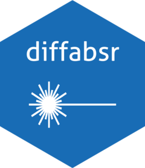

# diffabsr 

[](https://github.com/bluegreen-labs/diffabsr/actions)
[](https://codecov.io/gh/bluegreen-labs/diffabsr)
[](https://cran.r-project.org/package=diffabsr)
[](https://www.repostatus.org/#active)
[](https://doi.org/10.5281/zenodo.4814939)

Converts data from the [DiffAbs beamline](https://www.synchrotron-soleil.fr/en/beamlines/diffabs) at the [SOLEIL synchrotron](https://www.synchrotron-soleil.fr/) into an R compatible format. In addition it provides functions to convert the raw spectra to elemental counts and or concentrations. Data is returned nested lists of data frames or tidy data frames.

## How to cite this package in your article

You can cite this package like this "we processed the data using the R package `diffabsr` (Hufkens 2020)". Here is the full bibliographic reference to include in your reference list (don't forget to update the all caps fields for VERSION, MONTH and YEAR):

> Hufkens, K., Regeur S. (2020). diffabsr: the SOLEIL DIFFABS beamline data management package. (VERSION). Zenodo. https://doi.org/10.5281/zenodo.4814939. Last accessed MONTH YEAR

## Installation

### development release

To install the development releases of the package run the following
commands:

``` r
if(!require(devtools)){install.packages("devtools")}
devtools::install_github("bluegreen-labs/diffabsr")
library("diffabsr")
```

Vignettes are not rendered by default, if you want to include additional
documentation please use:

``` r
if(!require(devtools)){install.packages("devtools")}
devtools::install_github("bluegreen-labs/diffabsr", build_vignettes = TRUE)
library("diffabsr")
```

## Citation

Koen Hufkens & Solenn Regeur. (2020, December 20). bluegreen-labs/diffabsr: diffabsr (Version v0.1.0). Zenodo. [http://doi.org/xxx](http://doi.org/xxx).

## Acknowledgements

This project was supported the Marie Skłodowska-Curie Action (H2020 grant 797668) and the SOLEIL user support grant 20191271.

